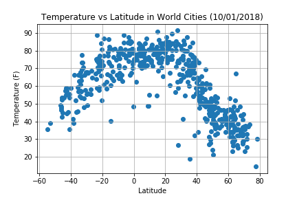
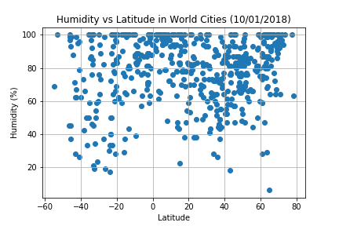
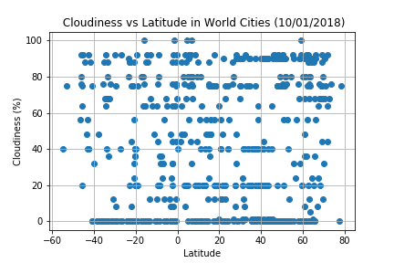

# HW6 - WeatherPy
The objective was to build a series of scatter plots to showcase the following relationships:
* Temperature (F) vs. Latitude
* Humidity (%) vs. Latitude
* Cloudiness (%) vs. Latitude
* Wind Speed (mph) vs. Latitude

The output scatter plots processed on the jupyter notebook (WeatherPy_PaulXLV.ipynb) are shown below with analysis summary! 

## Analysis
1. There is parabolic relationship between the latitude locations of the cities and its temperatures. The cities that are near the equator fall from comfortable to very hot temperatures (from 60 to 95 deg (F)). But cities located further away from equator starts dropping temperatures. Cities located on the opposite side of equator are very cold temperature ranges.
2. There is no strong relationship between latitude and cloudiness. However, there are strong band of cities that have 0, 20 and 90% cloudiness.
3. There is no strong relationship between latitude and wind speed. However, majority of the cities sampled fall between 0 and 20 mph wind speeds and there are two cities with very high speeds between 35 and 45 mph.
4. There is no strong relationship between latitude and humidity. But, there are strong band of cities that are exposed to 100% humidity!
